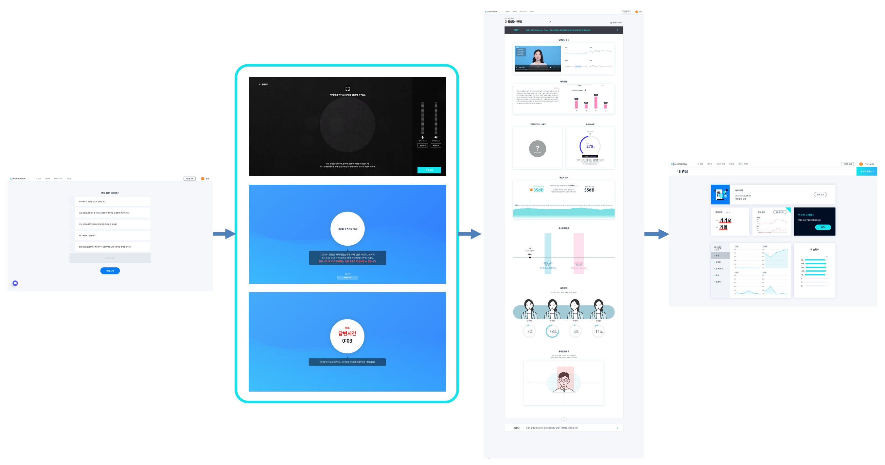
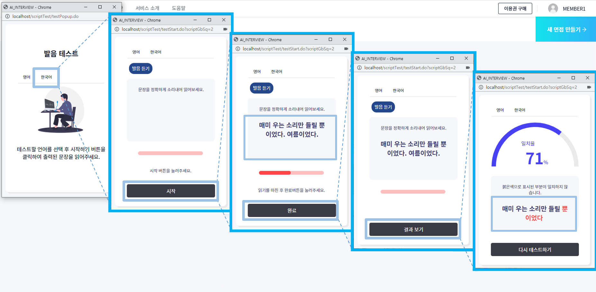

# A.I Interview Practice Service (인공지능 모의면접 서비스)

### introduce

영상 모의면접을 통해 분석 리포트를 제공하는 웹 사이트입니다.  
저희 웹 사이트는 인공지능을 기반으로 하여 사용자의 표정을 분석하여 감정, 태도(긍정, 부정, 무표정) 등을 수치화하여 제공하고 움직임을 분석하여 면적 표시,  
음성분석을 통해 답변 내용의 음절을 시간으로 나누어 말의 빠르기를 볼 수 있습니다. 또한 음량을 측정하여 발성의 상태를 확인할 수 있으며,  
언어분석을 이용하여 자주 사용하는 습관어, 반복어를 분석합니다.  

관리자의 메인 페이지에서는 면접 횟수, 매출, 인재상 분포, 요금제 수, 습관어와 반복어의 빈도수 등을 수치화하여 그래프로 한눈에 알아볼 수 있게 나타냈습니다.  
또한 관리 메뉴에서는 회원, 게시판, 요금제, 면접 관리 등을 보다 쉽게 관리할 수 있게 해놓았으며 필요할 때 출력을 위해서 각각 excel을 출력할 수 있게 지정했습니다.  

### schedule
- 진행기간

## techstack

### Front-end
  - HTML, Scss, JavaScript, jQuery

### Back-end 
  - java , jsp , spring Framework ,egov ,oracle
  
### 협업도구
  - Git, notion
  
### API
  - Ms Azure

## modeling

## 구현된 기능
### 회원기능

1. 회원가입 및 탈퇴
2. 로그인&로그아웃
3. 아이디 찾기&비밀번호 찾기
4. 내 프로필 조회 및 수정
5. 채팅을 이용한 서비스 문의

### 요금제기능

1. 아임포트 라이브러리와 카카오페이API를 이용한 구매
2. 요금제 및 결제 내역 조회

### 게시판기능

1. 게시판 말머리에 따른 게시글 구분
2. 계층형 게시판
3. 첨부파일 등록
4. 댓글 조회 및 작성, 수정, 삭제
5. 검색과 페이징

### 면접 및 분석기능

1. 마이크 및 웹캠 권한에 따른 안내 창 출력
2. 면접 준비를 위한 마이크,스피커 테스트
3. 질문 내용을 음성으로 출력하는 TTS
4. 답변 내용을 문서화하는 STT
5. 면접자의 발언과 매치되는 인재상 도출
6. 면접자의 답변 속도 분석
7. 자주 사용하는 습관어, 여러 번 발언한 반복어 도출
8. 면접자의 성량과 음역대를 수치화 하여 DB에 저장
9. 답변하는 면접자의 영상 녹화
10. 실시간 면접자 표정 및 얼굴 위치 분석
11. 면접 분석 결과 공유하기
12. 면접 데이터의 성장을 확인 할 수 있는 성장 그래프 출력

### 발음 테스트

1. 지문 내용을 음성으로 출력하는 TTS
2. 사용자의 음성을 문서화하는 STT
3. 지문과 사용자의 발음의 일치율 출력
4. 최근 5개의 결과를 확인 할 수 있는 성장 그래프 출력

### 관리자기능

1. 공지사항 글 등록 및 수정, 삭제
2. 채팅을 이용한 회원 문의 답변 작성
3. 관리자 운용을 위한 회원 권한 변경
4. 서비스 이용 데이터를 EXCEL파일로 출력
5. 데이터를 EXCEL파일로 일괄등록
6. 특정 데이터를 찾기위한 검색
7. 데이터의 변동을 쉽게 알아보기 위한 통계 출력
8. 세밀한 검색를 위한 기간 검색과 정렬(대충 무슨느낌인지 이해가능?)
9. 서비스 관리를 위한 데이터 생성 및 수정, 삭제

## 주요 기능

### 프로세스 흐름도

### 1. 면접 진행

### 2. 발음 테스트

## document
:link:[https://www.notion.so/PROJECT-AI_INTERVIEW/document](https://www.notion.so/69f50ccbaa424603a33f400895574a89)

## more link
:link:[https://www.notion.so/PROJECT-AI_INTERVIEW](https://www.notion.so/PROJECT-AI_INTERVIEW-ce429c320cac4d7d918c3783d5bc3f28)

## developer
홍정기: https://github.com/JEOLKI  
강태경:   
이명호:   
이승석:   
최윤지:   

