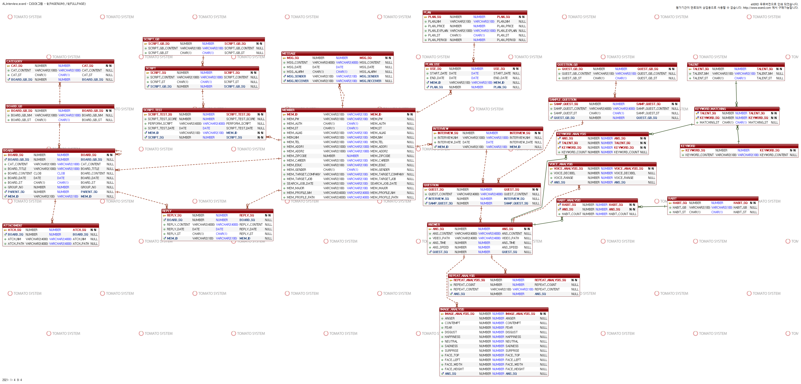
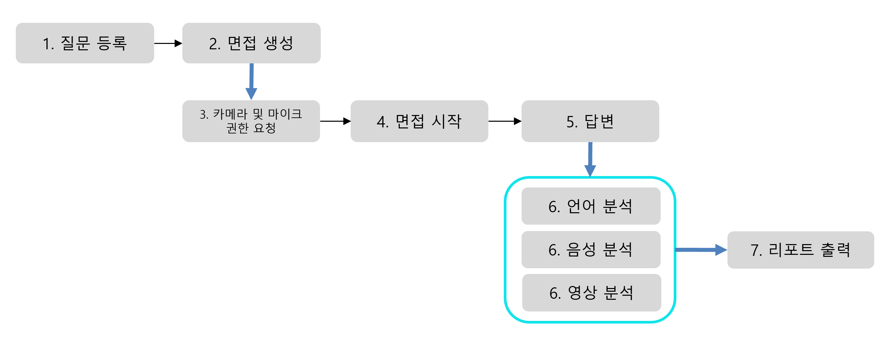
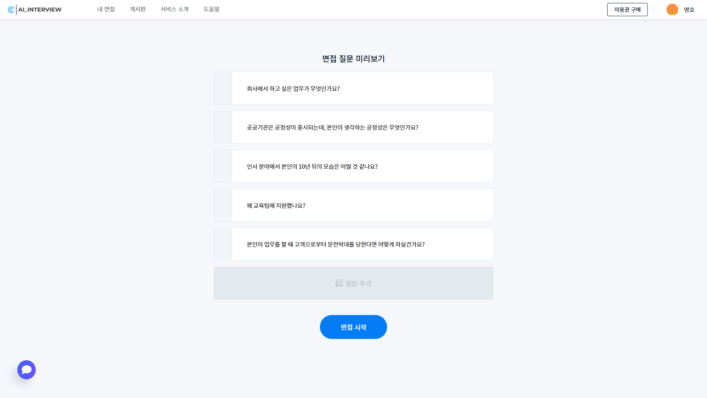
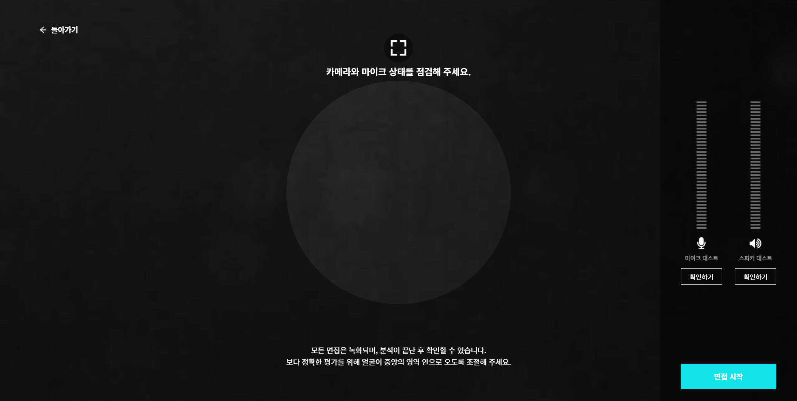
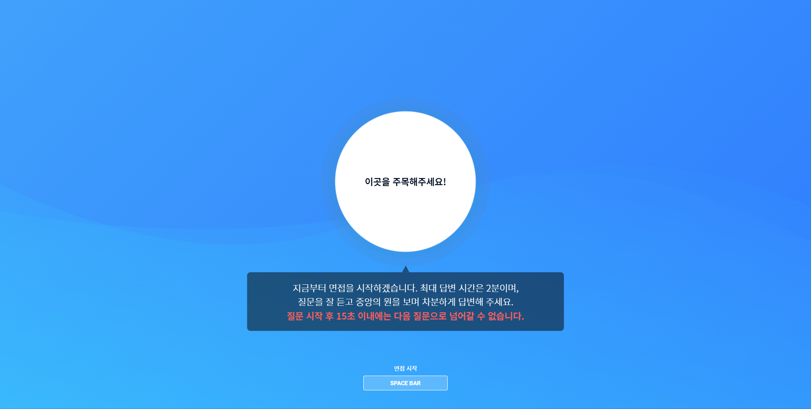
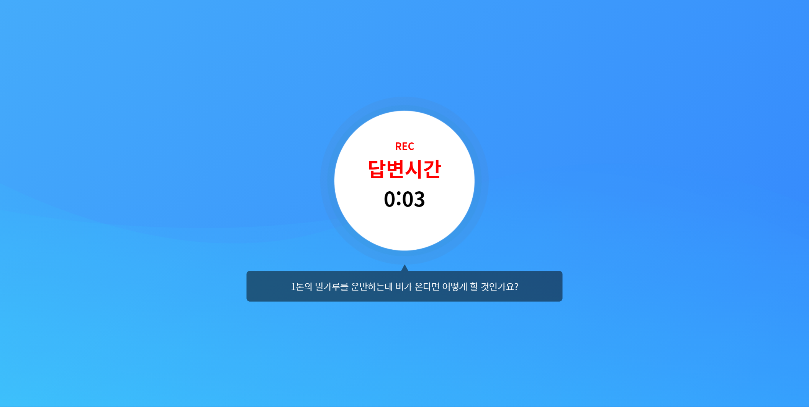
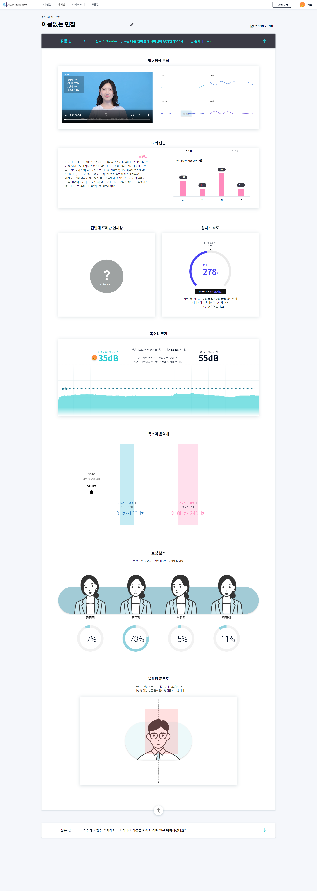
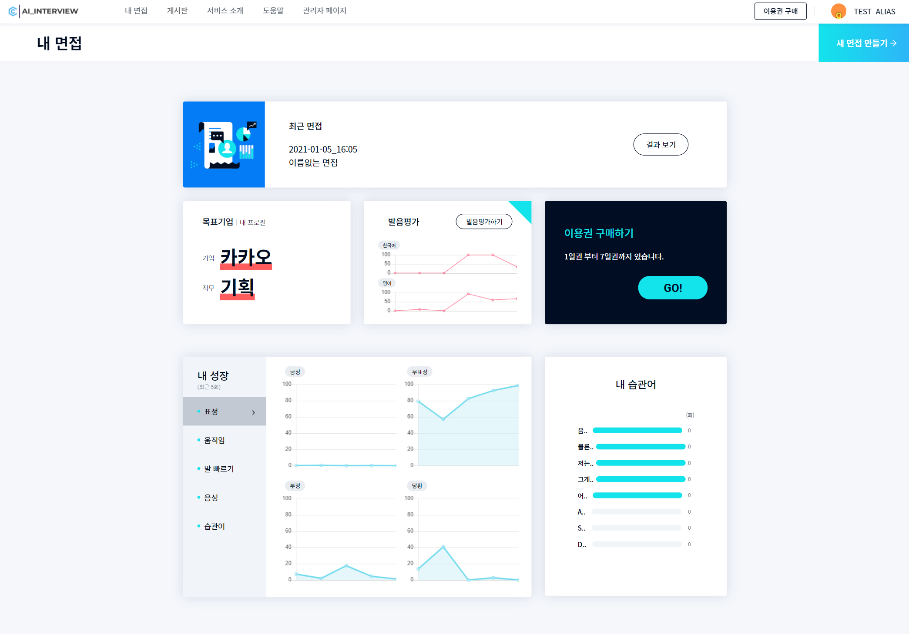
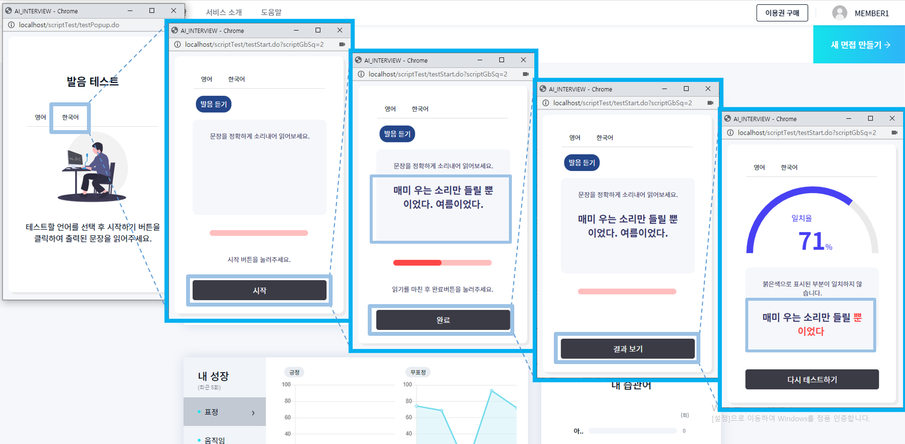

# A.I Interview Practice Service (인공지능 모의면접 서비스)

### introduce

영상 모의면접을 실시하여 인공지능 기반 분석 리포트를 제공함으로써 면접의 부족한 점을 보완하는 분석 면접 트레이닝 웹 사이트입니다.  
면접자의 표정을 분석하여 감정, 태도(긍정, 부정, 무표정) 등을 수치화하여 제공하고 움직임을 분석하여 면적 표시, 음성분석을 통해 답변 내용의 음절을 시간으로  
나누어 말의 빠르기를 볼 수 있습니다. 또한 음량을 측정하여 발성의 상태를 확인 할 수 있으며,  
언어분석을 이용하여 자주 사용하는 습관어, 반복어를 분석합니다.  
회원 게시판 요금제 면접 컨텐츠
관리자는 회원, 게시판, 요금제, 면접 관리 등을 보다 쉽게 관리할 수 있게 해놓았으며
필요할 때 출력을 위해서 각각 excel을 출력할 수 있게 지정했습니다.  

영상 모의면접을 통해 분석 리포트를 제공하는 웹 사이트입니다.  
저희 웹 사이트는 인공지능을 기반으로 하여 사용자의 표정을 분석하여 감정, 태도(긍정, 부정, 무표정) 등을 수치화하여 제공하고 움직임을 분석하여 면적 표시,  
음성분석을 통해 답변 내용의 음절을 시간으로 나누어 말의 빠르기를 볼 수 있습니다. 또한 음량을 측정하여 발성의 상태를 확인할 수 있으며,  
언어분석을 이용하여 자주 사용하는 습관어, 반복어를 분석합니다.  

관리자의 메인 페이지에서는 면접 횟수, 매출, 인재상 분포, 요금제 수, 습관어와 반복어의 빈도수 등을 수치화하여 그래프로 한눈에 알아볼 수 있게 나타냈습니다.  
또한 관리 메뉴에서는 회원, 게시판, 요금제, 면접 관리 등을 보다 쉽게 관리할 수 있게 해놓았으며 필요할 때 출력을 위해서 각각 excel을 출력할 수 있게 지정했습니다.  

### schedule
- 진행기간

## techstack

| Option | tech stack |
| ------ | ----------- |
| Front-end   | HTML, Scss, JavaScript, jQuery  |
| Back-end | java / jsp / spring Framework / egov / oracle |

### using api
Azure

## modeling

## 구현된 기능
회원기능  
요금제기능  
게시판 구현  
면접기능  
발음테스트  
관리자 기능  

## 주요 기능

### 프로세스 흐름도

### 1. 면접 질문 설정

### 2. 면접 준비

### 3. 면접 화면

### 4. 면접 결과

### 5. 면접 페이지

### 6. 발음 테스트

## document
:link:[https://www.notion.so/PROJECT-AI_INTERVIEW/document](https://www.notion.so/69f50ccbaa424603a33f400895574a89)

## more link
:link:[https://www.notion.so/PROJECT-AI_INTERVIEW](https://www.notion.so/PROJECT-AI_INTERVIEW-ce429c320cac4d7d918c3783d5bc3f28)

## developer
홍정기: https://github.com/JEOLKI  
강태경:   
이명호:   
이승석:   
최윤지:   

